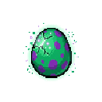
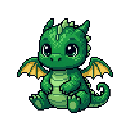
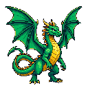
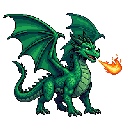
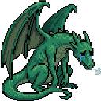
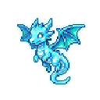

# 🐲 Git Dragon — The GitHub Tamagotchi

> A retro 16-bit pixel art Tamagotchi dragon that lives on your GitHub profile README and evolves or dies based on your commit streaks! Feed your dragon by staying active and writing code.

<p align="center">
  <a href="https://git-dragon.vercel.app">
    <!-- Live Demo Badge -->
    
  </a>
</p>

<p align="center">
  <a href="https://git-dragon.vercel.app"><strong>Hatch Yours Now »</strong></a>
</p>

---

## 🚀 How It Works (Paste Once, Run Forever)

You don't need to install any scripts, configure workflows, or run cron jobs. Everything updates **automatically and in real-time**:

1. **Get Your Code**: Go to [git-dragon.vercel.app](https://git-dragon.vercel.app), type in your GitHub username, and copy the Markdown snippet.
2. **Add to Profile**: Paste the snippet into your GitHub Profile `README.md`.
3. **Write Code**: As you push commits to GitHub, the serverless API dynamically scrapes your contribution graph, updates your dragon's stats, and renders its new evolved state instantly.

---

## 🧬 Evolution Guide

Keep your commit streak active to hatch and evolve your dragon. If you stop pushing code, your pet will starve and eventually turn into a ghost!

| Stage | Commit Streak | State | Sprite Preview |
| :--- | :--- | :--- | :---: |
| **Egg** | 0 - 2 Days | A mystical dragon egg pulsing with potential life. |  |
| **Baby** | 3 - 7 Days | A tiny, adorable newborn dragon exploring the world. |  |
| **Teenager** | 8 - 20 Days | A proud, energetic teenager testing its wings. |  |
| **Legendary** | 21+ Days | A magnificent adult dragon breathing pixelated plasma. |  |
| **Sad / Starving** | 48-Hour Gap | Droopy wings and crying eyes. Feed it before it's too late! |  |
| **Dead (Ghost)** | 5-Day Gap | Turned into a skeleton ghost. Revive it by pushing a commit. |  |

---

## 🛠️ Local Development

If you want to run the project locally or customize the sprites/logic:

### 1. Install dependencies
```bash
npm install
```

### 2. Run the development server
```bash
npm run dev
```
Open [http://localhost:3000](http://localhost:3000) in your browser to view the interactive dashboard.

---

## 🎨 Asset Customization

The dragon assets are processed and embedded as base64 PNGs inside `lib/dragonAssets.js` to ensure the serverless API routes render instantly without disk lag. 

If you replace the images in the `public/` folder, you can re-run the asset processing script to re-generate the base64 map:
```bash
# Autocrops borders, sets white to transparent, resizes to 128x128 nearest-neighbor, updates lib/dragonAssets.js
node .gemini/antigravity/brain/bcec44de-3d40-46fe-9141-7f55f6e29563/scratch/process_assets.js
```

---

## 📄 License

This project is open-source and licensed under the MIT License. Feel free to fork and build your own custom Tamagotchi extensions!
